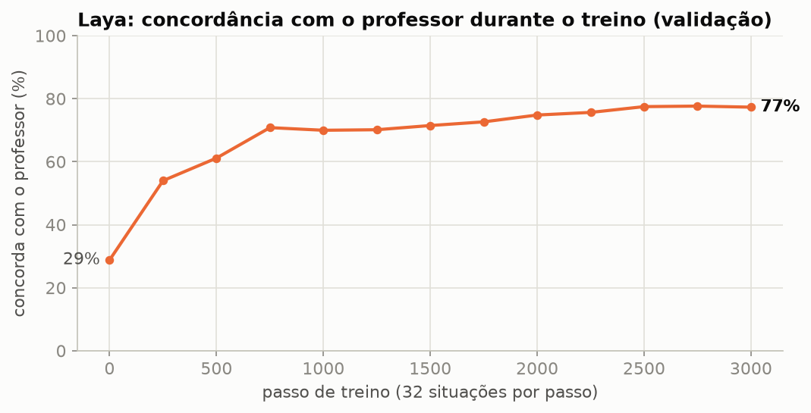
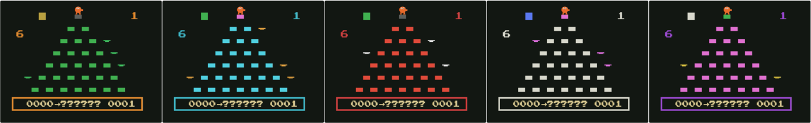

# Laya aprende Q\*bert: a mesma tarefa, outra IA, resultado oposto

Depois de treinar o NanoJev no Q\*bert (repositório **nanojev-qbert**), a pergunta inevitável: e outra IA de decisão,
com **o mesmo jogo, o mesmo professor e os mesmos 30 mil exemplos**? Aqui o modelo é o **Laya**
(ModernBERT-large, 421 M parâmetros, Apache-2.0). Mesmo PC (RTX 3060, 12 GB), só a IA mudou.


| | NanoJev | **Laya treinado** | Professor |
|---|---|---|---|
| Nível 1 (20 fases de teste) | 2/20 | **20/20** | 20/20 |
| Nível 2 (20 fases de teste) | 0/20 | **11/20** | 16/20 |
| Concordância com o professor | 55% | **77%** | — |
| Tempo por decisão | 0,3 s | **0,04 s** | — |
| Treino | 2 treinos, ~15 h | **1 treino, ~1 h** | — |

O robô de regras fixas completa 10/20 no nível 2 — o Laya treinado passou dele.

---

## Dois jeitos de decidir

- **NanoJev** (Qwen3-0.6B): lê **cada opção num texto separado**, junto com a situação inteira.
- **Laya** (ModernBERT-large): lê **a situação e todas as opções num texto só** e compara tudo de uma vez.
  Foi feito para triagem (escolher o setor de um e-mail ou chamado).

## Antes do treino: "casar palavras"

Sem treino, o Laya **pulava para fora da pirâmide em toda jogada** (0/20). Investigando: ele escolhe a opção que mais
**combina com o texto**, não a que dá certo. Se a situação diz "andar para a frente faz cair", ele escolhe andar
para a frente. Para triagem isso é perfeito; para jogar, um desastre. Além disso, o texto original (~830 tokens)
passava do limite de 512 tokens e era cortado sem aviso.

## O treino

1. **Situação enxuta** (`qbert/estado_compacto.py`): só o que muda a cada jogada — nível, regra de cor, cubos,
   posição, vidas, discos, inimigos, últimas jogadas. **~190 tokens** em vez de ~830 (e dos ~4.300 do NanoJev).
2. **Ajuste fino** (`treinar_laya.py`) imitando as notas do professor (temperatura 4), entropia cruzada,
   AdamW (2e-5 no codificador, 1e-4 na cabeça), *gradient checkpointing*, teto de 10 GB na placa.
3. **3.000 passos × 32 situações** em ~1 hora (0,7 s por passo, contra ~30 s do NanoJev); pausas automáticas
   para esfriar a placa a 80 °C, ponto de retomada e vigia (`vigiar_treino.ps1`). Melhor versão: passo 2.500.



> O segredo não foi a placa: foi **tirar do texto as regras que se repetiam em toda jogada**. Cada passo de treino caiu
> de 30 segundos para menos de 1, e em 1 hora o Laya viu 4× mais exemplos que o NanoJev.

## Extras da página (`qbert/index.html`, porta 8768)

- **Turbo** — sem as pausas feitas para olhos humanos (animações, bônus, tela de nível).
- **Gravar até o fim** — grava só a área do jogo e para sozinha 2 s depois do *game over*; o servidor converte para MP4.
- **Níveis 5 a 9** criados para este projeto, com cores, discos e inimigos mais difíceis:



## O que tem aqui

```
laya-qbert/
├── qbert/
│   ├── qbert_env.py          # o jogo (com os níveis 5–9)
│   ├── estado_compacto.py    # a situação em ~190 tokens
│   ├── servidor_laya.py      # servidor da página (porta 8768) com o Laya carregado na placa
│   ├── index.html            # a página (turbo, gravação, níveis novos)
│   ├── converter_video.py    # WebM → MP4
│   └── videos/               # uma partida do Laya gravada
├── treinar_laya.py           # o ajuste fino
├── vigiar_treino.ps1         # vigia de temperatura e disco durante o treino
├── iniciar_qbert_laya.bat    # liga o servidor e abre o navegador (Windows)
├── resultados/               # registro do treino (log, progresso, configuração do melhor modelo)
├── docs/                     # artigo do LinkedIn comparando NanoJev × Laya
└── imagens/
```

## Como rodar

1. `pip install "laya[serve]"` (Python 3.10+; PyTorch com CUDA recomendado). O modelo original baixa sozinho do
   Hugging Face (`convaiinnovations/laya`, ~800 MB).
2. Jogar: `python qbert/servidor_laya.py --modelo convaiinnovations/laya` (Laya original) ou apontando para a pasta
   do modelo treinado → <http://127.0.0.1:8768>.
3. Treinar: os 30 mil exemplos estão no repositório **nanojev-qbert** (`qbert/dados/*.jsonl.gz`); ajuste a variável
   `DADOS` no começo de `treinar_laya.py` e rode `python treinar_laya.py --passos 3000 --saida runs/laya_qbert_v1`.
   O modelo treinado não está no repositório (tamanho).

## Lições

1. Cada IA nasce para uma tarefa; fora dela, precisa ser ensinada.
2. O **formato da entrada** vale tanto quanto o modelo.
3. **Velocidade de treino é poder**: quem testa mais, aprende mais.

## Créditos e licença

- **Laya** — Convai Innovations: <https://github.com/NandhaKishorM/laya>, <https://huggingface.co/convaiinnovations/laya>
  (Apache-2.0). Codificador **ModernBERT-large** (Answer.AI / LightOn, Apache-2.0).
- **Jogo, professor e dados**: repositório **nanojev-qbert** (derivado do NanoJev, MIT, © OpenJev contributors).
- Q\*bert é marca da Gottlieb/Sony; esta é uma recriação própria para pesquisa, sem ROM, imagens ou código originais.
- Adaptações, treino, página e documentação: Mateus Silva.

Licença: **Apache-2.0**, herdada do Laya — veja [`LICENSE`](LICENSE) e [`NOTICE`](NOTICE).
